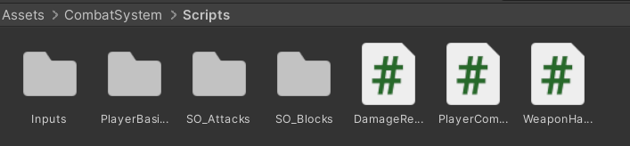
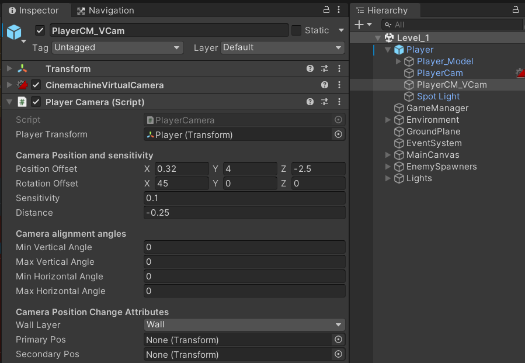
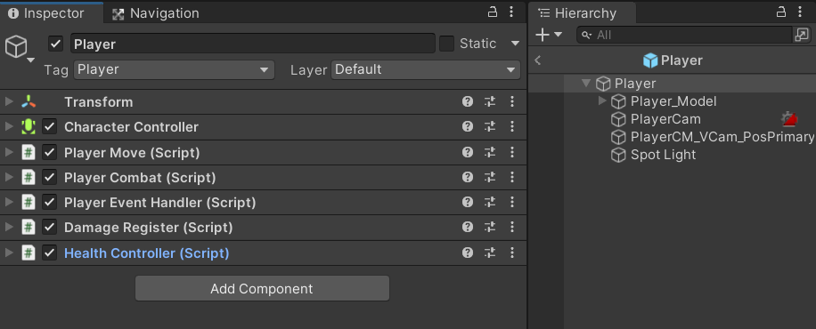
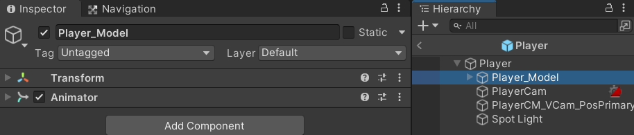
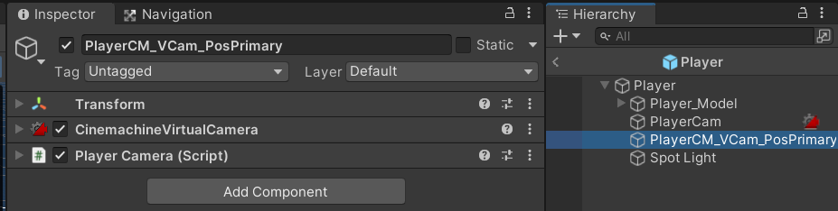

# Combat System

- The Combat System is a simple starter point for any user tryng to add combat to the game they are developing.
- This is written in C# for Unity and requires little understanding of code. 
- This system is mainly made for programmers for quick prototyping.

## Table Of Contents
- [Installation](#installation)
    - [How to add to project](#how-to-add-it-in-your-existing-project)
- [Instruction For Use](#how-to-use-it-in-your-project)
    - [Damage Register](#damageregister-script-and-its-use)
    - [Weapon Handler](#weaponhandler-and-where-to-add-it)
    - [Attack and Block SO's](#attackso-blockso-and-how-to-make-your-own)
- [Player Prefab Setup Examples](#player-prefab-setup-examples)

## Installation

`NOTE: The Combat System uses the new input system but this can be customized or changed as per requirement. If you are not using the new input system you would not require the Inputs folder from the CombatSystem Folder.`

### How to add it in your existing project

- This can be done by adding the CombatSystem folder from [this GIT repository](https://github.com/sachitnjk/CombatSystem/tree/main/Assets).
- These are the contents of the CombatSystem Folder:
1. Inputs folder:
    1. Contains the `InputProvider` script.
    2. Contains the `PlayerInput` ( an input actions component).
2. Player Basics folder:
    1. Contains the `PlayerMove` script.
    2. Contains the `PlayerCam` script.
3. SO_Attacks folder:
    1. Constains subfolders that have a few premade scriptable objects(in light and heavy attack folders)that are basically used for the attack animations.
    2. Also contains the `AttackSO` script that is used to make the attack scriptable objects.
4. SO_Blocks folder: 
    1. Constins Subfolder that have few premade scriptable objects that are used for the block animations.
    2. Also contains the `BlockSO` script that is used to make the block scriptbale objects.
5. `PlayerCombat` script.
6. `DamageRegister` script. (More on [the `DamageRegister` script and it's use](#damage-register-script-and-its-use))
7. `WeaponHandler` script. (More on [`WeaponHandler` and where to add it](#where-to-add-the-weaponhandler-script))

# Instructions to use it in your project

`NOTE: If you are using the contents from the Inputs folder of this CombatSystem, follow steps 1 - 2 else skip to step 3.`

1. Add an empty GameObject in your scene. This empty game object is going to be used to store our inputs so name it appropriately.
2. Add the `PlayerInput` component along with the `InputProvider` script.

`NOTE: Once you have your player prefab along with the animations, animator all set up, follow from step 3.`

3. If you want to use the provided `PlayerMove` script on your player prefab, go ahead and add the 'PlayerMove' script to the prefab along with a **Character controller**, *else skip over to step 4*.
    1. Also add the `PlayerCam` script to the player camera (Virtual Camera is using Cinemachine for camera).
    2. The `PlayerCam` script will require a direct reference to the players transform. Drag in the player transform on scene directly in it or feel free to **edit it according to requirement**.

`NOTE: If using the provided PlayerMove script, add the actual player model with the animator as a child of the Object on which the PlayerMove script is added.`

4. Add the `PlayerCombat` script on your player prefab.
    1. The player combat needs references to the `AttackSO` objects, the `BlockSO` objects, the player animator and the player entity which has the `Weapon Handler` script. (More on [`WeaponHandler` and where to add it](#where-to-add-the-weaponhandler-script) also [Attack, Block SO's and How to make custom](#attackso-blockso-and-how-to-make-your-own)).

5. On any entity that is going to take damage, add the `DamageRegister` script. (More on [the `DamageRegister` script and it's use](#damage-register-script-and-its-use))

# Player prefab setup examples

### `DamageRegister` script and it's use

### `AttackSO`, `BlockSO` and How to make your own

### `WeaponHandler` and where to add it
